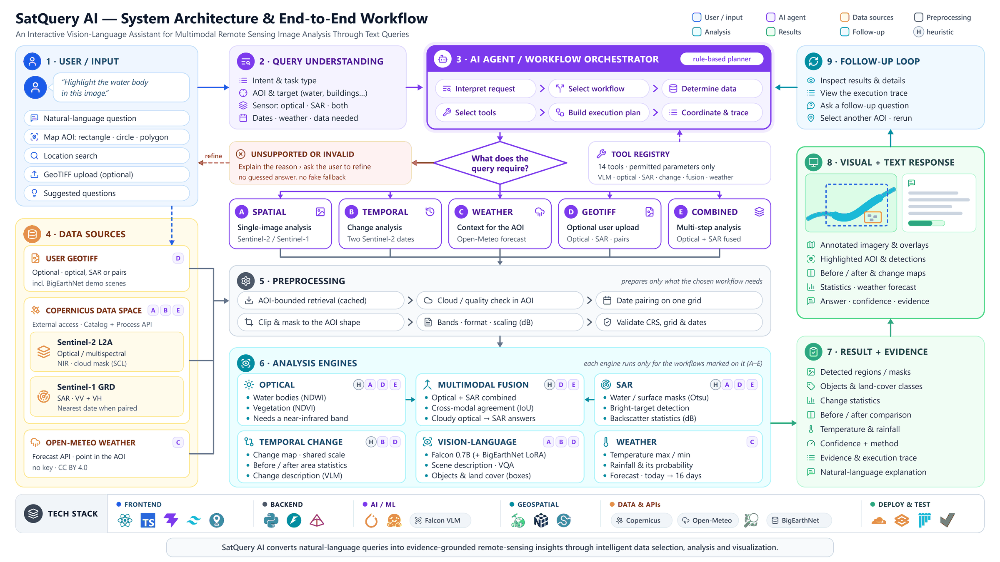

# SatQuery AI

**An Interactive Vision-Language Assistant for Multimodal Remote Sensing Image Analysis Through Text Queries.**

Ask a question about a place in plain language. SatQuery AI selects the imagery the question needs (Sentinel-2 optical,
Sentinel-1 radar, a before/after pair, or a weather forecast), plans which analysis tools to run, and answers with
visual evidence pinned to the map, a confidence value with its method, and a full execution trace.



## Features

- **Natural-language questions:** question answering, scene description and grounding ("highlight the water body")
  by a remote-sensing vision-language model (Falcon, 0.7B parameters), loaded with a LoRA adapter the team
  fine-tuned on BigEarthNet.txt yes/no questions (see [Fine-Tuning / Model Adaptation](#fine-tuning--model-adaptation)).
- **Map-based area selection:** place search, then a rectangle, circle or polygon drawn on the map.
- **Sentinel-1 / Sentinel-2 analysis:** imagery for the drawn area is retrieved live from the Copernicus Data Space
  Ecosystem. Water questions are answered from optical imagery first (NDWI); when the selected area itself is too
  cloudy by Sentinel-2's scene classification, Sentinel-1 radar answers instead.
- **Temporal change analysis:** before/after Sentinel-2 scenes chosen from the dates in the question, with a change
  map and before/after area statistics.
- **Optical + SAR joint analysis:** optical and radar evidence combined, with an agreement score.
- **Weather context:** a short-range forecast (today to 16 days) for a point inside the selected area (Open-Meteo).
- **GeoTIFF upload and analysis:** optical, SAR, or co-registered pairs; the modality is read from the band
  descriptions. PNG/JPEG images are accepted too and open in an off-map viewer.
- **Visual + textual results:** overlays pinned to the imagery on the map, a plain-language answer, confidence with its
  method, the step-by-step execution trace, and downloadable HTML and JSON reports.
- **Agentic, auditable workflow:** a rule-based agent classifies the request, plans a sequence of registered tools
  (each with permitted parameters only), executes it and records every step. Unsupported or invalid requests are
  refused with a stated reason rather than answered with a guess.

## Tech Stack

| Layer | Technologies |
|---|---|
| Frontend | React, TypeScript, Vite, Tailwind CSS, MapLibre GL, Terra Draw, Zustand |
| Backend | Python, FastAPI, Uvicorn, Pydantic, httpx |
| AI / ML | PyTorch, Hugging Face Transformers, PEFT (LoRA), Falcon remote-sensing VLM (0.7B) with the team's BigEarthNet.txt LoRA adapter |
| Geospatial | Rasterio (GDAL), NumPy, SciPy, Pillow |
| Data & APIs | Copernicus Data Space Ecosystem (Sentinel Hub Catalog and Process APIs), Open-Meteo, OpenStreetMap Nominatim, BigEarthNet sample patches |
| Testing | pytest, Vitest |
| Optional | Gradio (fallback UI), Cloudflare Tunnel (public demo link) |

## Requirements

- **Python 3.12** (3.10 to 3.12 are supported; 3.13 is not).
- **Node.js 20 or newer** with npm (tested with Node.js 24).
- **Internet access:** basemaps, place search, Copernicus, Open-Meteo, and the one-time model download.
- **Disk space:** about 3.5 GB for the model, which is downloaded from Hugging Face on first use and cached, plus
  about 1-3 GB for the Python packages (more with the CUDA build of PyTorch).
- **A free Copernicus Data Space Ecosystem account** for live imagery of a drawn area (see
  [Environment Variables](#environment-variables)).
- **GPU optional.** With an NVIDIA GPU a model call takes well under a second and uses about 2 GB of VRAM. On CPU the
  same call takes roughly 15-20 seconds.

## Installation

The commands below are for Windows PowerShell; on Linux/macOS use `.venv/bin/python` instead of
`.venv\Scripts\python`.

```powershell
git clone <repository-url> satquery-ai
cd satquery-ai

# 1. Python environment (with uv; see "Using pip instead" below)
uv venv --python 3.12 .venv
# Optional, NVIDIA GPU only: install the CUDA build of PyTorch first
uv pip install --python .venv torch==2.8.0 --index-url https://download.pytorch.org/whl/cu128
uv pip install --python .venv -e ".[server,models,copernicus,adaptation]"

# 2. Web client
cd web
npm ci
npm run build
cd ..
```

**Using pip instead of uv:** create the environment with Python 3.12 (`py -3.12 -m venv .venv`), then run
`.venv\Scripts\python -m pip install -e ".[server,models,copernicus,adaptation]"` (for a GPU, first
`.venv\Scripts\python -m pip install torch==2.8.0 --index-url https://download.pytorch.org/whl/cu128`).

**About the `adaptation` extra:** it installs PEFT 0.17.1 and Accelerate 1.10.1, which the fine-tuned adapter needs,
alongside the pinned Transformers 4.49.0 (the Falcon model's code does not work with Transformers 4.50 or newer).
Install them through this extra as shown; a separate `pip install peft` can upgrade Transformers and break the model.

## Environment Variables

Configuration is read from environment variables, or from a `.env` file in the repository root (which is gitignored
and must never be committed). Start from the template:

```powershell
Copy-Item .env.example .env
```

Then edit `.env`:

| Variable | Required | Purpose |
|---|---|---|
| `COPERNICUS_CLIENT_ID` | For live imagery | OAuth client ID for the Copernicus Data Space Ecosystem |
| `COPERNICUS_CLIENT_SECRET` | For live imagery | OAuth client secret for the same client |
| `SATQUERY_VLM_BACKEND` | Yes | `falcon` for the real model; `fake` gives placeholder answers (tests and UI work only) |
| `SATQUERY_DEVICE` | No | `auto` (default), `cuda` or `cpu` |
| `SATQUERY_FALCON_ADAPTER` | No | Defaults to the included LoRA adapter, `adapters/falcon-bigearthnet-vqa-lora`; set it to an empty value to run the base model |

**Getting Copernicus credentials:** create a free account at
[dataspace.copernicus.eu](https://dataspace.copernicus.eu), open the Sentinel Hub dashboard, go to
**User settings → OAuth clients**, and create a client. Copy its client ID and secret into your own `.env`. The secret
is shown only once. Never put real credentials in the README, source code, or any committed file.

Without Copernicus credentials the app still starts: uploaded GeoTIFFs, the built-in demo scenarios and weather
questions work, and a question about a drawn area explains that imagery retrieval is not configured.

Weather needs no key (the free Open-Meteo API). `.env.example` lists every optional setting with its default.

## Running the Application

```powershell
.venv\Scripts\python -m uvicorn satquery.server:app --port 8000
```

Open **http://127.0.0.1:8000**. FastAPI serves both the API and the built web client on this one port. The first
question that needs the model downloads it (see Requirements); later runs start from the cache.

To share a temporary public link to your running instance (optional), tunnel the port, for example with
`cloudflared tunnel --url http://localhost:8000`. The computer must stay on while the link is in use.

**Tests** (synthetic data, no GPU, no network, no credentials):

```powershell
uv pip install --python .venv -e ".[dev]"
.venv\Scripts\python -m pytest
cd web; npm test; cd ..
```

**Gradio interface (fallback):** `uv pip install --python .venv -e ".[ui]"`, then `.venv\Scripts\python app.py`.

## Demo Workflow

1. **Find a place.** Open **Search location** in the left toolbar and search, for example, *Loktak Lake*.
2. **Select an area.** Open **Select area**, choose **Rectangle**, and drag over the lake. (Live imagery retrieval
   uses a rectangle; circles and polygons work for uploaded imagery and weather questions.)
3. **Ask about water.** Type *Highlight the water body in this image.* SatQuery retrieves the latest suitable
   Sentinel-2 scene for the area, measures cloud inside the area, and highlights water with NDWI, or with Sentinel-1
   radar if the area is too cloudy. The result card states which scene was used and why.
4. **Ask about change.** For example *What changed here over the last 12 months?* Two Sentinel-2 scenes are compared
   (before/after imagery, change map and area statistics). Periods can also be named: *since June*,
   *between 2019 and 2024*. If no scene clear enough exists in a period (common in monsoon months), the app says so
   and suggests a longer or earlier period instead of guessing.
5. **Ask about the weather.** For example *What's the temperature going to be this week?* or *Will it rain here
   tomorrow?* The forecast is for a point inside the selected area, which is marked on the map.
6. **Upload a GeoTIFF.** Use **Add data** (the **+** button in the command bar) and upload a file, for example
   `demo/examples/bigearthnet_river_austria/s2_bgrn.tif`, then ask *Describe the land-cover and major objects visible in
   this image.*
7. **Use a suggested question.** Once an area or image is selected, suggested questions appear above the command
   bar. **Help** in the sidebar also offers one-click demo scenarios, including optical + SAR analysis and a
   before/after pair.
8. **Inspect the result.** **Details** opens the execution trace: the routing decision, every tool with its
   parameters, the input checks, and the HTML/JSON reports.

## Fine-Tuning / Model Adaptation

The vision-language model runs with a **LoRA adapter trained by the SatQuery AI team** on
[BigEarthNet.txt](https://huggingface.co/datasets/BIFOLD-BigEarthNetv2-0/BigEarthNet.txt), loaded by default as in
our live demo. Every execution trace names it: the model reads
`mehmetbayik/Falcon-Single-Instruction-Large + adapters/falcon-bigearthnet-vqa-lora`.

**What the fine-tuning covers:** yes/no visual question answering about **Sentinel-2** image patches (presence,
count, area and adjacency of land-cover classes). It does not train the model for weather, SAR, change detection,
captioning, grounding or any other SatQuery AI capability; those run as they did before, and a regression check on
the demo scenarios found no degradation in captioning, grounding or change detection.

| | |
|---|---|
| Base model | `mehmetbayik/Falcon-Single-Instruction-Large` (837 M parameters) |
| Method | LoRA (PEFT): rank 8, alpha 16, dropout 0.05, on the 96 decoder attention projections; vision tower frozen |
| Trainable parameters | 1,572,864 (0.188% of the model) |
| Data | BigEarthNet.txt yes/no rows with BigEarthNet v2.0 Sentinel-2 patches: 7,360 train / 1,064 validation / 1,794 test rows, splits disjoint by patch, answers balanced 50% yes |
| Training | 1 epoch (920 steps), learning rate 2e-4 with cosine decay, effective batch 8, seed 7; 27.4 minutes on an RTX 4050 Laptop GPU |

**Result on the full held-out test set** (1,794 rows from 500 patches never seen in training; exact-match, same code
and settings before and after):

| | Base model | With adapter | Change |
|---|---|---|---|
| **Overall** | 49.72% | **66.33%** | **+16.61 pp** |
| adjacency (n=325) | 56.31% | 67.38% | +11.07 pp |
| area (n=483) | 46.38% | 61.90% | +15.52 pp |
| count (n=482) | 43.15% | 64.11% | +20.96 pp |
| presence (n=504) | 54.96% | 72.02% | +17.06 pp |

The test set is balanced, so always giving the same answer would score 50%.

**Limitations:** Sentinel-2 only (120 x 120 px patches at 10 m); yes/no questions only; land-cover class balance was
not controlled when selecting patches; exact-match on short answers is a narrow metric.

**Evidence and reproduction:**

- `adapters/falcon-bigearthnet-vqa-lora/`: the adapter (6.3 MB, SHA-256
  `b7b1388f6c60918877c587e28707c994b64a0798a9ccf9f5c4d9fb0a31336100`), its training config, loss log and model card.
- `experiments/adaptation/`: dataset, training, evaluation and report code, with the recorded results in
  `results/` (dataset manifest, evaluations before and after, overfit check, regression check, report).
- `experiments/adaptation/test_split/`: the 1,794-row test split with its 500 rendered patches
  (CDLA-Permissive-1.0), so the evaluation can be re-run without downloading BigEarthNet:

```powershell
.venv\Scripts\python experiments\adaptation\evaluate.py --data experiments\adaptation\test_split --split test `
    --adapter adapters\falcon-bigearthnet-vqa-lora --out eval_after.json
```

Add `--device cpu --dtype fp32` without a CUDA GPU, `--limit 100` for a quick check, and omit `--adapter` for the
base model. Retraining needs BigEarthNet.txt and BigEarthNet v2.0; see `experiments/adaptation/README.md`.

## Notes and Limitations

- Heuristic components (spectral-index and SAR thresholds, the change map, the optical/SAR agreement) are labelled as
  heuristic in the app and in every trace. Confidence values are not calibrated; each states its method.
- Weather questions are answered separately from imagery questions; a question that asks for both is refused with
  guidance. Only short-range forecasts are supported (today to 16 days).
- Radar change over time is not supported yet; before/after analysis uses Sentinel-2.
- A drawn area for live retrieval is limited to 400 km².
- The fine-tuned adapter covers Sentinel-2 yes/no questions only (see
  [Fine-Tuning / Model Adaptation](#fine-tuning--model-adaptation)); no claim is made for other sensors, such as
  Cartosat or RISAT, or other question types.

## Data and Licences

- Code: Apache License 2.0 (see `LICENSE`).
- Demo imagery in `demo/examples/`: BigEarthNet v2.0 / BigEarthNet.txt (CDLA-Permissive-1.0) and Copernicus Sentinel
  exports. Contains modified Copernicus Sentinel data. See `demo/examples/README.md`.
- Live imagery: Copernicus Sentinel data via the Copernicus Data Space Ecosystem. SatQuery AI is an independent
  project and is not affiliated with or endorsed by Copernicus or the European Commission.
- Weather: Open-Meteo.com, CC BY 4.0 (attributed in every weather answer).
- Model: `mehmetbayik/Falcon-Single-Instruction-Large` on Hugging Face, downloaded at run time and subject to its own
  licence. The LoRA adapter in `adapters/` is the team's own work and is used together with that base model.
- Fine-tuning test split in `experiments/adaptation/test_split/`: a modified subset of BigEarthNet.txt and
  BigEarthNet v2.0, published under CDLA-Permissive-1.0 with the required notices, citations and licence text in its
  README. Contains modified Copernicus Sentinel data.
- Basemaps: OpenFreeMap / OpenStreetMap contributors, and Esri World Imagery.

## Team

**Team Overtime** · Team ID: **128665**

Problem Statement: **SIH26167**
